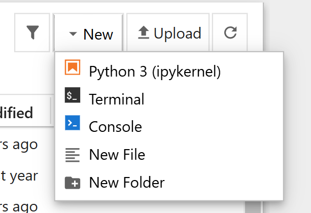

# El primer Notebook

Este será un paso frecuente en todas las clases en las que cambiemos de tema, por ello decidí apartar una lección especial para ello.

## Creación con Jupyter

Si tienes activa un sesión de Jupyter, para crear un nuevo Notebook vacío (`.ipynb`), podemos usar la opción `Python 3 (ipykernel)` que se muestra en la siguiente imagen:



## Creación manual

También podemos crearlo de manera manual dentro de la carpeta deseada, pero siempre teniendo en cuenta que la extensión debe ser `.ipynb`, dentro debemos seleccionar el kernel de python con el cual trabajará nuestro archivo.

### Selección de Kernel

La manera más sencilla es mantener una sección activa de Jupyter y usar la dirección `http://localhost:8888/tree` en la cual está corriendo el Jupyter Server.

También podemos crear un entorno de python dedicado al proyecto, y para ello podemos usar el siguiente comando:

```bash
python -m venv <nombre_del_entorno>
```

Para activarlo en windows puedes usar el siguiente comando:

```bash
<nombre_del_entorno>\Scripts\activate
```

Y en Unix o MacOS puedes ejecutar:

```bash
source <nombre_del_entorno>/bin/activate
```

Para desactivar el entorno puedes usar el siguiente comando:

```bash
deactivate
```

> Puedes saber más en el siguiente enlace: [Entornos virtuales y paquetes](https://docs.python.org/es/3.13/tutorial/venv.html)

Teniendo presente el entorno de python, puedes seleccionarlo desde el notebook y así trabajar con el.

## Alternativa a Jupyter Notebook

Si por algún motivo no puedes usar Jupyter en tu equipo, puedes usar una herramienta online de Google llamada Google Colab, en donde tendrás un entorno asociado a tu cuenta de Google y con recursos virtuales que te permitirán trabajar (ten en cuenta que son recursos que presentan un limite, pero aún así, son muy útiles)

|Anterior||Siguiente|
|--------|-|---------|
|[El primer Notebook](./02-El_primer_notebook.md)|[README](../README.md)|[Algoritmos, Pseudocódigo y Diagramas de Flujo](./03-Algoritmos_Peudocodigo_y_Diagramas_de_Flujo.md)|
