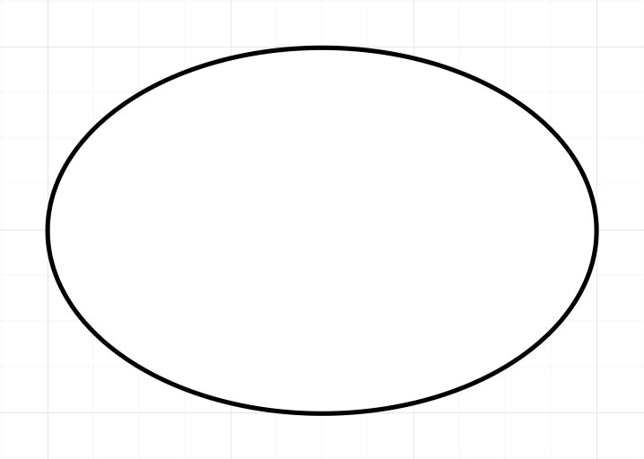
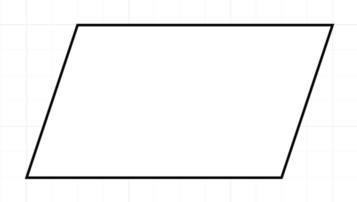
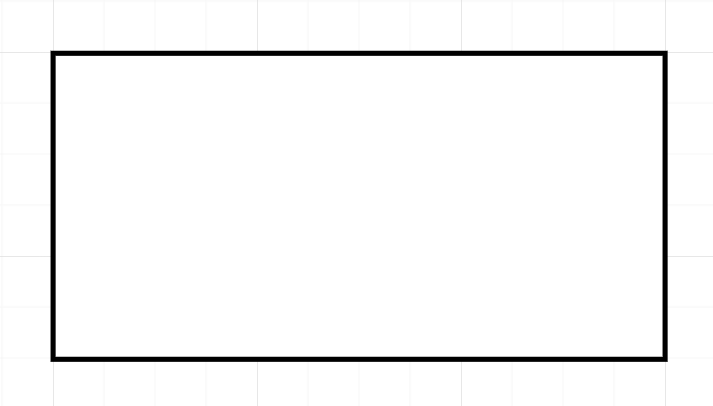
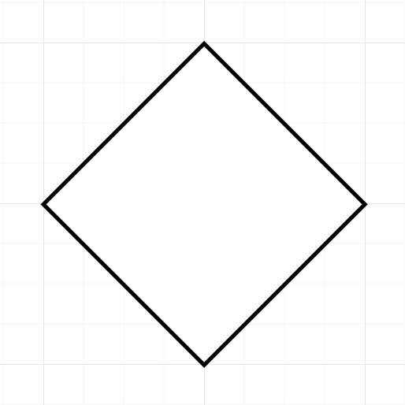
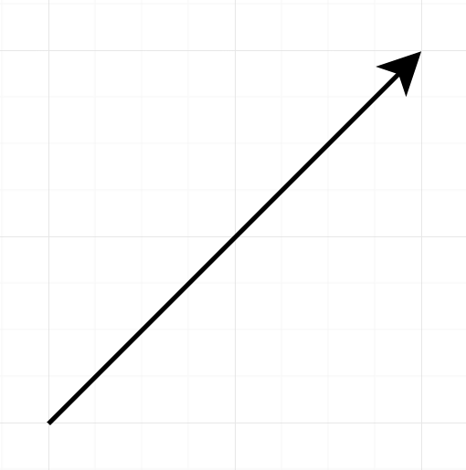
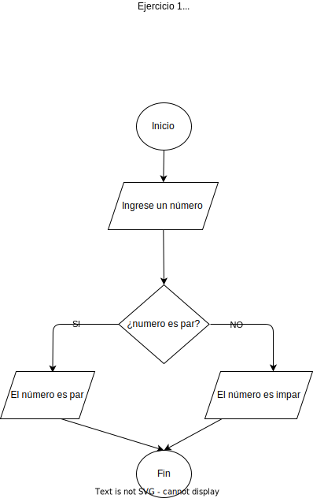
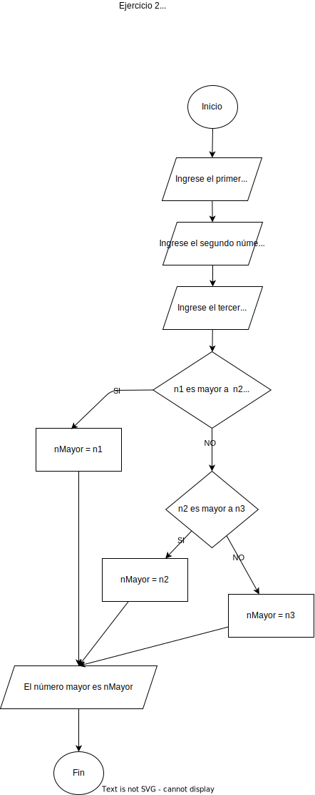
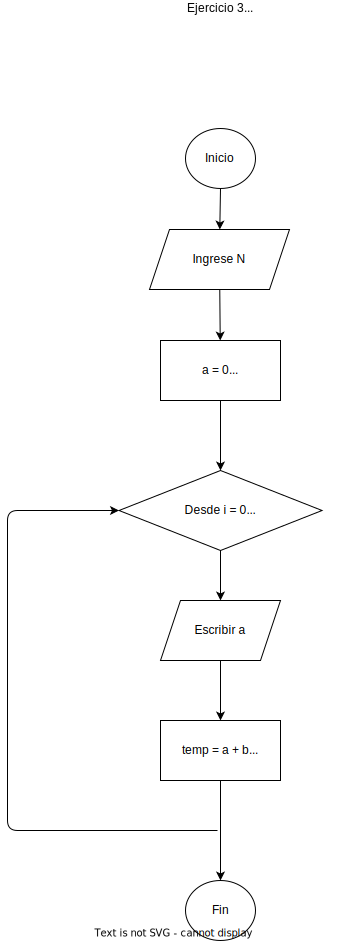

# Algoritmos, Pseudocódigo, y Diagramas de Flujo

## ¿Qué es un Algoritmo?

Un ***algoritmo*** es una secuencia finita de pasos bien definidos que resuelven un problema o realizan una tarea específica. Debe cumplir con características como ser preciso, definido y finito. Los algoritmos pueden expresarse en distintos formatos, como lenguaje natural, diagramas de flujo o pseudocódigo.

### Características de los algoritmos

1. **Entrada**: Reciben datos de entrada
2. **Proceso**: Realizan una serie de pasos definidos
3. **Salida**: Generan un resultado
4. **Definición precisa**: Cada paso debe estar bien especificado
5. **Finitud**: Deben terminar en un número finito de pasos

## ¿Qué es Pseudocódigo?

El ***pseudocódigo*** es una manera estructurada y semiformal de representar algoritmos utilizando una combinación de lenguaje natural y estructuras similares a un lenguaje de programación. Es independiente de cualquier lenguaje específico (agnóstico) y ayuda a los programadores a planificar la lógica antes de implementarla en código real.

### Características del pseudocódigo

1. **Agnóstico**: Independiente al lenguaje de programación
2. **Semiformal**: Combina lenguaje natural y estructuras de programación
3. **Palabras Claves**: Utiliza palabras claves como `Inicio`, `Fin`, `Si... Entonces... Sino...`, `Mientras`, etc. *No se limita a una sola versión o un solo idioma*, por ejemplo, se puede usar tanto `Mostrar` como `Escribir` con el fin de enviarle un mensaje al usuario.
4. **Previsión**: Se usa para estructurar la lógica antes de codificar en un lenguaje formal.

## Relación entre Algoritmo y Pseudocódigo

El pseudocódigo actúa como un puente entre el algoritmo teórico y la implementación en un lenguaje de programación. Proporciona una descripción clara y estructurada de los pasos del algoritmo sin depender de la sintaxis de un lenguaje en particular.

En otras palabras, La relación entre ambos conceptos radica en que el ***pseudocódigo sirve como una herramienta intermedia*** entre el diseño del algoritmo y su implementación en un lenguaje de programación.

## Ejemplos de Pseudocódigo

### Ejercicio 1

*Problema*: Determinar si un número ingresado por el usuario es par o impar utilizando pseudocódigo.

*Solución*:

```txt
Inicio
    Escribir "Ingrese un número: "
    Leer numero
    
    Si numero mod 2 = 0 Entonces:
        Escribir "El número es par"
    Sino
        Escribir "El número es impar"
    FinSi
Fin
```

### Ejercicio 2

*Problema*: Dados 3 números ingresados por el usuario, determinar cual de ellos es el mayor.

*Solución*:

```txt
Inicio
    Escribir "Ingrese el primer número: "
    Leer numero1
    Escribir "Ingrese el segundo número: "
    Leer numero2
    Escribir "Ingrese el tercer número: "
    Leer numero3

    Si (numero1 > numero2) y (numero1 > numero3) Entonces
        numero_mayor := numero1
    Si (numero2 > numero3) Entonces
        numero_mayor := numero2
    Sino
        numero_mayor := numero3
    FinSi

    Escribir "El número mayor es: ", numero_mayor
Fin
```

### Ejercicio 3

*Problema*: Listar los primeros `N` números de la serie de Fibonacci

*Solución*:

```txt
Inicio
    Escribir "¿Cuantos números quieres mostrar?: "
    Leer n

    a := 0
    b := 1

    Para i Hasta n Hacer
        Escribir **a**
        temp := a + b
        a := b
        b := temp
    FinPara
Fin
```

## ¿Que es un Diagrama de Flujo?

Un **diagrama de flujo** es una representación gráfica de un algoritmo mediante símbolos estandarizados que muestran el flujo de ejecución del proceso.

### Principales símbolos en Diagramas de Flujo

|Símbolo|Nombre|Descripción|
|-|-|-|
||Óvalo|Inicio-Fin|
||Paralelogramo|Entrada-Salida de datos|
||Rectángulo|Procesos o cálculos|
||Rombo|Decisión (Condicional)|
||Flecha|Flujo del algoritmo|

## Representación del los ejemplos de Pseudocódigo en Diagramas de Flujo

### Ejercicio 1 - Diagrama



### Ejercicio 2 - Diagrama



### Ejercicio 3 - Diagrama



## Bibliografía

- Cormen, T. H., Leiserson, C. E., Rivest, R. L., & Stein, C. (2009). **Introduction to Algorithms**. MIT Press.
- Wirth, N. (1976). **Algorithms + Data Structures = Programs**. Prentice Hall.
- Knuth, D. E. (1997). **The Art of Computer Programming**. Addison-Wesley.
- Pressman, R. S. (2014). **Ingeniería del Software: Un Enfoque Práctico**. McGraw-Hill.

|Anterior||Siguiente|
|--------|-|---------|
|[Instalación de Python y Jupyter Notebooks](./01-Instalacion_de_Python_y_Jupyter_Notebooks.md)|[README](../README.md)|[Introducción a Python cómo lenguaje de programación](./04-Estructuras_de_datos.md)|
